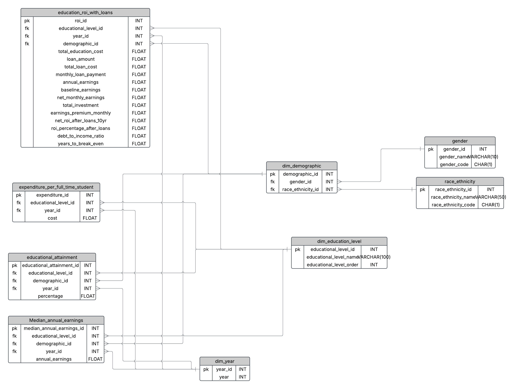

# Education ROI Analysis Project

## Overview
This project analyzes the Return on Investment (ROI) in higher education by combining educational costs, student loan considerations, and earnings data. It processes data from multiple sources to provide insights into the financial value of different education levels across various demographic groups.

## Database Schema
The project uses a PostgreSQL database with the following key tables:

### Fact Tables
- `education_roi_with_loans`: ROI calculations including loan considerations
- `Median_annual_earnings`: Annual earnings data by education level
- `educational_attainment`: Educational attainment percentages
- `expenditure_per_full_time_student`: Education costs per student

### Dimension Tables
- `dim_educational_level`: Education level classifications
- `dim_demographic`: Demographic information
- `dim_year`: Year dimension for time-based analysis
- `gender`: Gender classifications
- `race_ethnicity`: Race and ethnicity classifications


#### Database Schema


## Project Structure

```
.
├── extract_tabn502_30.py        # Data extraction for earnings/attainment
├── extract_tabn334_10.py        # Data extraction for education costs
├── load_tabn502_30.py           # Data loading for earnings/attainment
├── load_tabn334_10.py           # Data loading for education costs
└── education_roi_with_loans.py  # ROI calculations with loan analysis
```

## Features
- Data extraction from Excel files
- Comprehensive ETL pipeline
- Student loan impact analysis
- ROI calculations including:
  - Break-even analysis
  - Loan payment calculations
  - Net earnings after loan payments
  - Long-term ROI projections

## Setup and Installation

### Prerequisites
- Python 3.x
- PostgreSQL
- Required Python packages:
  ```
  pandas
  psycopg2
  numpy
  ```

### Database Configuration
Update the database parameters in each loader script:
```python
db_params = {
    'dbname': 'your_dbname',
    'user': 'your_username',
    'password': 'your_password',
    'host': 'your_host',
    'port': 'your_port'
}
```

### Running the Analysis

1. Load base data:
```bash
python load_tabn502_30.py  # Load earnings and attainment data
python load_tabn334_10.py  # Load education cost data
```

2. Run ROI analysis:
```bash
python education_roi_with_loans.py
```

## Data Flow
1. Extract: Read and process Excel files
2. Transform: Clean and structure data
3. Load: Insert data into PostgreSQL database
4. Analyze: Calculate ROI metrics including loan impact

## Key Metrics
- Total education cost
- Loan amounts and payments
- Annual earnings by education level
- Net monthly earnings after loan payments
- Years to break even
- ROI percentage after loans
- Debt-to-income ratio

## Notes
- Loan calculations assume a 6.68% interest rate
- Standard 10-year loan repayment period
- 70% of education costs are assumed to be financed
- Break-even calculations compare against high school graduate earnings

## Contributing
Please read [CONTRIBUTING.md](CONTRIBUTING.md) for details on our code of conduct and the process for submitting pull requests.

## License
This project is licensed under the MIT License - see the [LICENSE.md](LICENSE.md) file for details